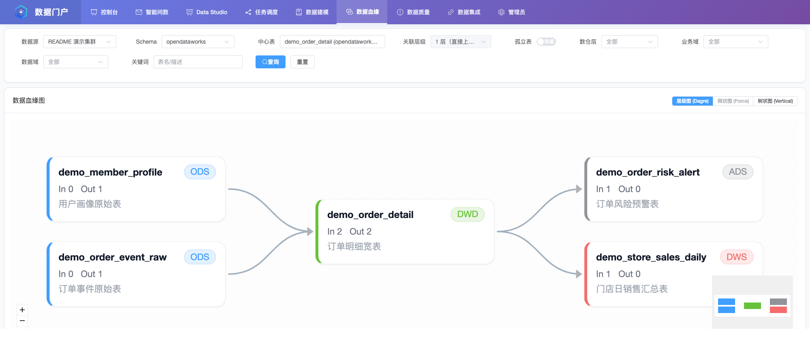
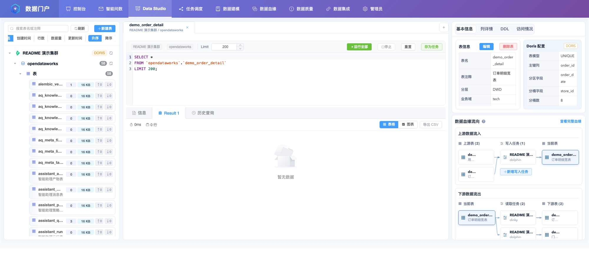

# opendataworks

<p align="center">
  <picture>
    <source media="(prefers-color-scheme: dark)" srcset="frontend/public/opendataworks-icon-dark.svg">
    
  </picture>
</p>

<div align="center">

<p align="center">
  <a href="https://github.com/MingkeVan/opendataworks/stargazers"></a>
  <a href="https://github.com/MingkeVan/opendataworks/network/members"></a>
  <a href="https://github.com/MingkeVan/opendataworks/pulls"></a>
  <a href="https://github.com/MingkeVan/opendataworks/issues"></a>
  <a href="https://github.com/MingkeVan/opendataworks/blob/main/LICENSE"></a>
  <a href="https://github.com/MingkeVan/opendataworks/releases"></a>
  <a href="https://deepwiki.com/MingkeVan/opendataworks"></a>
</p>

**一站式数据任务管理、智能问数与数据血缘可视化平台**

[🌐 项目主页](https://mingkevan.github.io/opendataworks/) | [English](README_EN.md) | 简体中文

[快速开始](docs/guide/start/quick-start.md) · [功能特性](docs/guide/manual/features.md) · [架构设计](docs/guide/architecture/design.md) · [开发文档](docs/guide/configuration/index.md) · [贡献指南](docs/guide/contribution/guide.md)

</div>

---

## 📖 项目简介

opendataworks 是一个面向大数据平台的统一数据门户系统,旨在为企业提供一站式的数据资产管理、任务调度编排和血缘关系追踪解决方案。

## 🎯 核心价值

- **统一管理**: 集中管理数据表元信息、数据域、业务域等数据资产
- **任务编排**: 可视化配置批处理和流处理任务,支持 DolphinScheduler 深度集成
- **血缘追踪**: 自动生成数据血缘关系图,实现数据链路全链路可视化
- **开箱即用**: 提供完整的前后端实现,快速部署即可使用

## ✨ 功能概览

- 📊 **数据资产管理**: 元数据管理、分层管理 (ODS/DWD/DIM/DWS/ADS)
- 🔄 **任务调度**: 批处理任务、SQL/Shell 支持、DolphinScheduler 集成
- 🔗 **血缘可视化**: 自动解析血缘、ECharts 可视化、链路追踪
- 🤖 **智能问数**: 主前端内置自然语言转 SQL 与结果执行能力
- 📈 **执行监控**: 实时状态、历史日志、统计分析

## 🌐 项目演示地址

[https://opendataworks-demo.vercel.app](https://opendataworks-demo.vercel.app)

## 🖼️ 界面预览

### 任务调度


工作流列表、发布状态与常用操作入口。

### 数据血缘



围绕中心表查看上下游链路与层级关系。

### Data Studio



目录浏览、SQL 编辑与表级元数据联动分析。

### Docker 部署

#### 开发环境快速启动

如果希望一次性在本机拉起完整环境（前端 + 后端 + DataAgent Backend + Redis + MySQL + Portal MCP），可使用开发环境 Compose：

```bash
# 1. 准备配置
cp deploy/.env.example deploy/.env

# 2. 拉取最新镜像
docker compose -f deploy/docker-compose.dev.yml pull

# 3. 启动服务
docker compose -f deploy/docker-compose.dev.yml up -d

# 访问
# 前端: http://localhost:8081
# 后端: http://localhost:8080/api
# DataAgent Backend: http://localhost:8900
# Portal MCP: http://localhost:8801/mcp
```

#### 生产环境/离线部署

请参考 [部署文档](deploy/README.md) 获取详细的生产环境部署和离线包制作指南。

## 🚀 快速开始

请参考 [快速开始指南](docs/guide/start/quick-start.md) 进行部署和启动。

## 📚 文档

详细文档请查看 [docs/](docs/) 目录：

- **[快速开始](docs/guide/start/quick-start.md)**
- **[架构设计](docs/guide/architecture/design.md)**
- **[配置说明](docs/guide/configuration/index.md)**
- **[常见问题](docs/guide/faq/faq.md)**

## 🤝 贡献

欢迎提交 PR 或 Issue！详见 [贡献指南](docs/guide/contribution/guide.md)。

## 📄 许可证

本项目采用 [GNU General Public License v3.0 only](LICENSE) 开源协议。
