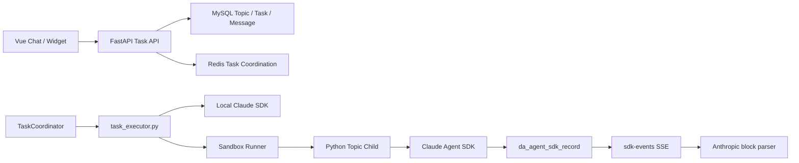
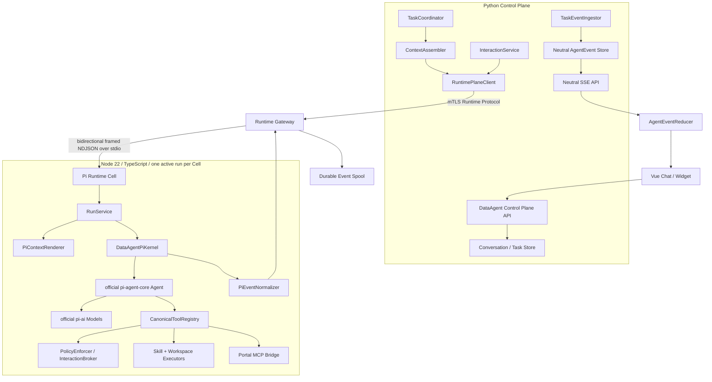
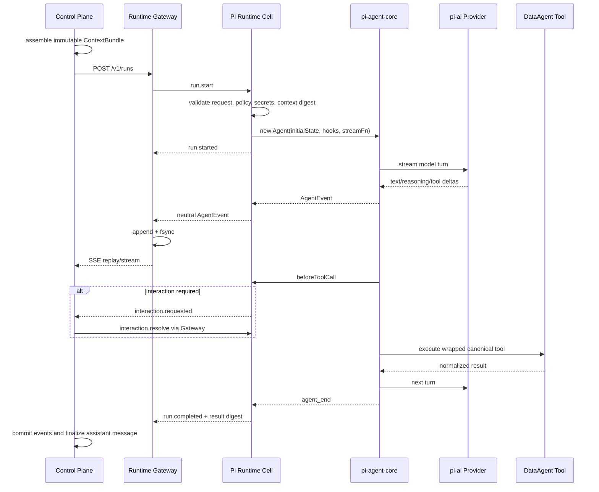

# DataAgent Pi Official Agent Kernel

**Date:** 2026-09-08
**Goal:** 使用 Pi 官方 TypeScript Agent 内核构建 DataAgent 自有 Runtime Plane，使 DataAgent 掌握任务、消息、上下文、事件、工具、权限和持久化语义，同时保持部署期单 Runtime、Provider 可配置和未来内核可替换。
**Tech Stack:** Control Plane（Python、FastAPI、AnyIO、MySQL 8、Redis）、Runtime Gateway（Python、FastAPI、Docker/Podman、SSE）、Pi Runtime Cell（Node.js 22.19+、TypeScript、`@earendil-works/pi-agent-core`、`@earendil-works/pi-ai`）、Portal MCP、Vue 3
**Plan:** [2026-09-08-dataagent-pi-agent-kernel-plan.md](../plans/2026-09-08-dataagent-pi-agent-kernel-plan.md)

## Scope

### In Scope

- 把 Pi 官方 `pi-agent-core` 作为 DataAgent Runtime Plane 内部的 Agent Loop 内核。
- Python Control Plane、Runtime Gateway 和 Node.js Pi Runtime Cell 的明确边界。
- 部署期固定 `pi_agent_core` Runtime；应用启动后不按 Topic、请求或故障动态切换 Runtime。
- DataAgent Conversation、Context、Runtime、Agent Event、Interaction 和 Canonical Tool 契约。
- 消息提交、传输、事件存储、历史读取、上下文组装、Pi message 映射和最终消息投影。
- Pi Provider、Tool、Event、Abort、Steering、Permission 和 Session 能力的接入方式。
- Skill、Portal MCP、workspace、artifact、provider secret 和 sandbox 的运行边界。
- 事件耐久性、Runtime Cell 丢失、取消、超时、重试、部署锁、灰度和回退。
- 从现有 Claude Agent SDK 路径迁移到 Pi 内核的阶段化方案。

### Dependencies

本方案依赖两个前置提案中的中立契约，但不要求它们与 Pi 实现同时合入：

- [PR #448 DataAgent Conversation and Context Model](https://github.com/opendata-lab/opendataworks/pull/448)：提供 `ConversationMessage`、`HistoryQuery`、`ContextSnapshot` 和 `ContextBundle` 的权威定义。
- [PR #449 DataAgent Runtime Plane and Single-Active Adapter](https://github.com/opendata-lab/opendataworks/pull/449)：提供 Runtime Protocol、Agent Event Protocol、Gateway durable spool、安全通道和部署锁的基础定义。

如果最终选择 Pi 为内核，PR #449 中“Pi 只是候选 Adapter”的判断由本方案替代；其外层 Control/Data Plane 契约、安全和恢复设计仍可复用。

### Non-Goals

- 不使用或维护第三方 Python 版 Pi Agent Loop。
- 不通过 `pi-py-sdk` 作为生产运行时契约。
- 不把 `@earendil-works/pi-coding-agent` CLI、TUI、用户目录和扩展生态整体嵌入服务端。
- 首版不使用实验性的 `@earendil-works/pi-server`、`pi-client`、`pi-protocol` 或 Agent Harness 作为 DataAgent 对外协议。
- 不让 Pi Session、Pi message 或 Provider 原生 block 成为业务消息和历史记录的权威来源。
- 不在同一环境同时运行 Claude Agent SDK 与 Pi 来承接生产流量。
- 不做 Claude 失败后自动切 Pi，也不尝试跨 Runtime 恢复原生 Session。
- 不把 OpenCode Zen/Go Provider 与 OpenCode Agent Server 混为一谈；前者只是模型入口，后者包含独立 Agent 行为。
- 不把 NL2SQL 特有脚本、命令参数或 prompt recipe 移入通用 Pi Runtime 模块。

## Decision Summary

### Pi Is the Kernel, Not Another Adapter

本方案改变的是 Agent Loop 的所有权：

- Adapter 方案中，Claude Agent SDK 或 OpenCode Server 拥有 Agent Loop，DataAgent 负责翻译它们的行为。
- Pi Kernel 方案中，DataAgent 定义 Agent 产品语义，Pi 官方内核负责一次 turn 内的模型流和工具调度。
- Provider 由 `pi-ai` 统一，但 Provider 切换不是 Runtime 切换。

因此首版 Runtime Plane 内不再设计 `ClaudeAdapter | OpenCodeAdapter | PiAdapter` 三选一的工厂。Pi 是唯一运行内核；DataAgent 自己的 `ContextRenderer`、`ToolRegistry`、`PolicyEnforcer` 和 `EventNormalizer` 围绕它组成完整 Runtime。

上线后的可配置边界为：

| Layer | Deployment/runtime behavior |
| --- | --- |
| Agent kernel | 固定 `pi_agent_core`，进程生命周期内不可切换 |
| Model Provider | 由 `pi-ai` allowlist 支持，可继续按现有 Agent Profile/管理配置选择 |
| Claude Agent SDK | 只作为迁移期上一版本制品和发布回退路径，不在 Pi 环境同时运行 |
| OpenCode Server | 本方案不部署；OpenCode Zen/Go 仅可作为经过验证的模型 Provider |
| Future kernel | 通过 DataAgent Runtime Protocol 接入新的独立制品和部署，不在请求中动态发现 |

### Official Packages and Version Policy

设计研究基线固定为：

```text
@earendil-works/pi-agent-core 0.85.1
@earendil-works/pi-ai         0.85.1
Node.js                       >= 22.19.0
upstream commit               b2602be77cb7b0de45dd616407fd210daa48aa75
license                       MIT
```

生产依赖使用精确版本和 lockfile，不使用 `^`、`latest` 或启动时动态安装。升级 Pi 必须经过独立兼容 PR 和 conformance suite。

仓库根 `.nvmrc` 当前是 Node `20.19.0`，而 Pi `0.85.1` 要求 Node `>=22.19.0`。本方案不全局升级前端 Node 基线；Pi Runtime 使用独立子项目、独立 `.nvmrc` 和独立 Node 22 镜像。

### Use `Agent`, Defer Agent Harness and Pi Server

首版直接使用官方文档化的 `Agent`：

- `initialState` 注入 system prompt、model、tools 和 messages。
- `streamFn` 绑定 `pi-ai` Provider collection。
- `transformContext` 和 `convertToLlm` 提供明确的上下文转换点。
- `beforeToolCall`、`afterToolCall` 和 `shouldStopAfterTurn` 提供策略钩子。
- `subscribe()` 提供 turn、message、tool 和流式 delta 事件。
- `abort()`、`steer()`、`followUp()` 提供运行控制能力。

Pi 官方 Server/Protocol 当前明确标记为 experimental，且不提供 peer authentication 或兼容性保证；它的 Session/Facet/Harness 所有权也会与 DataAgent 的 Task、Context、Interaction 和事件持久化重叠。因此它不作为首版服务边界。后续只有在协议稳定、认证补齐并通过独立 ADR 后，才允许在 Runtime Cell 内部替换传输实现。

## Current State

当前执行链路为：



主要耦合点：

| Concern | Current owner | Coupling |
| --- | --- | --- |
| Agent Loop | `core/task_executor.py` | Claude options、message classes、session resume |
| Prompt/history | `task_coordinator.py`, `core/agent_runtime.py` | UI message 直接拼成文本 |
| Stream persistence | `core/sdk_block_writer.py` | 识别 Claude Python class name 和 Anthropic block |
| Frontend | `v2StreamParser.js` | 解析 `content_block_start/delta/stop` |
| Interaction | SDK callback + SDK records | Permission/Question 状态与执行 trace 混合 |
| Runtime child | Python sandbox child | 仍持有业务 MySQL 凭据并直接写库 |
| Session | Topic `conversation_id` | 实际绑定 Claude native session |

现有 Sandbox Runner 已经具备 container child、Topic warm affinity、取消和 NDJSON stream 的基础能力，但它的 payload、子进程和存储仍与 Claude/Python 实现耦合。

## Problem

### A Python Port Would Create a Second Kernel

第三方 Python 移植会把上游 Pi 的 Agent Loop 复制到另一个维护链。工具并发顺序、事件屏障、Provider stream、重试、context overflow 和 abort 等语义都可能漂移。它降低了语言边界，却增加了真正的内核分叉。

### Using the Full Coding Agent Imports the Wrong Product Boundary

`pi-coding-agent` 面向本地交互式编码场景，包含 CLI、用户目录、package/extension 加载、认证和 session 管理。DataAgent 已经有自己的 UI、用户、Topic、Task、Skill、MCP、权限和存储模型。整体嵌入会形成两套控制面。

### Owning the Loop Increases DataAgent Responsibilities

使用低层 Pi 内核可以降低对 Claude/OpenCode 产品行为的锁定，但 DataAgent 必须自己负责：

- ContextBundle 到模型上下文的确定性转换。
- 工具身份、schema、执行、权限、workspace 和 side-effect 语义。
- Interaction 的暂停、持久化、恢复和超时。
- 事件归一化、排序、耐久化、前端投影和最终消息生成。
- Provider credential、重试、限流、usage、context overflow 和模型差异。
- Cell crash、取消、部分输出和不可自动重试的副作用。

这不是单纯替换一个 SDK import，而是把 Agent 产品内核边界正式收回 DataAgent。

## Design

### Target Architecture



### Ownership Boundaries

| Capability | Authority | Pi role |
| --- | --- | --- |
| Topic, Task, message submission | Control Plane/MySQL | None |
| Semantic message history | Conversation Store | Receives selected messages only |
| Context selection | `ContextAssembler` | None |
| Runtime rendering | Versioned `PiContextRenderer` | Consumes rendered messages |
| Agent Loop | Pi Runtime Cell | Official `Agent` executes loop |
| Provider streaming | `pi-ai` | Owns provider protocol conversion |
| Tool identity/policy | DataAgent canonical contracts | Pi invokes wrapped tools |
| Tool process execution | Pi Runtime Cell sandbox | `Agent` schedules allowed tools |
| Interaction state | Control Plane/MySQL | `beforeToolCall` waits for resolution |
| Neutral run events | DataAgent Agent Event Protocol | Pi native events are input only |
| Event durability | Gateway spool + Control MySQL | No direct database access |
| Final assistant message | Control Plane projector | Derived from neutral events |
| Runtime session/checkpoint | Control Plane index/cache | Pi state is rebuildable cache |

### Proposed Module Layout

Control Plane remains Python:

```text
dataagent/dataagent-backend/core/agent_runtime/
  contracts.py
  client.py
  event_ingestor.py
  interaction_service.py
  deployment_lock.py
  security.py
  session_index.py
```

Runtime Gateway evolves from the existing Sandbox Runner:

```text
dataagent/dataagent-backend/runtime_gateway/
  app.py
  supervisor.py
  cell_protocol.py
  event_spool.py
  capability.py
  workspace.py
```

Pi Runtime is a separate Node.js package:

```text
dataagent/dataagent-runtime-pi/
  .nvmrc                         # 22.19.0 or later pinned line
  package.json
  package-lock.json
  tsconfig.json
  Dockerfile
  src/
    main.ts
    contracts/
      runtime.ts
      agent-events.ts
      generated/
    server/
      cell-channel.ts
      run-service.ts
    kernel/
      dataagent-pi-kernel.ts
      pi-agent-factory.ts
      pi-event-normalizer.ts
      run-state-machine.ts
    context/
      pi-context-renderer.ts
      message-converter.ts
      token-budget.ts
    providers/
      model-registry.ts
      provider-config.ts
      credential-resolver.ts
    tools/
      canonical-tool-registry.ts
      tool-aliases.ts
      tool-result-normalizer.ts
      executors/
    policy/
      policy-enforcer.ts
      workspace-boundary.ts
    interactions/
      interaction-broker.ts
    skills/
      skill-loader.ts
    mcp/
      portal-mcp-client.ts
    observability/
      metrics.ts
      redaction.ts
  test/
```

通用模块不得出现 `run_sql.py`、NL2SQL prompt recipe 或部署绝对路径。智能查询行为继续以 Skill bundle 为唯一来源。

### Runtime Cell Protocol

Control Plane 与 Gateway 使用 PR #449 的 versioned HTTP/SSE Runtime Protocol。Gateway 与 Pi child 使用私有、双向、带版本的 framed NDJSON stdio channel，避免为每个 Cell 开端口：

```text
Gateway -> Cell
  hello
  run.start
  interaction.resolve
  run.steer
  run.follow_up
  run.cancel
  cell.shutdown

Cell -> Gateway
  hello.ack
  run.accepted
  run.event
  run.heartbeat
  run.settled
  protocol.error
```

每条 frame 包含：

```text
protocol_version
cell_id
run_id
task_attempt_id
frame_id
type
payload
```

规则：

- 每个 Cell 同时最多一个 active run；同 Topic warm reuse 只减少进程启动时间，不改变消息权威来源。
- `(run_id, task_attempt_id)` 幂等；重复 `run.start` 返回已有状态，不重复执行工具。
- stdout 只允许协议 frame，日志写 stderr；非 JSON stdout 视为 protocol violation。
- Gateway 验证 runtime sequence、追加并 fsync neutral event 后才允许向 Control Plane 暴露；不重写已经确认的 sequence。
- stdin resolution/cancel 与 stdout event 共用一个 run state machine，未知或已终态 run 的命令必须拒绝。
- channel 具备 bounded queue 和背压；事件不能因消费者变慢而无限占用 Cell 内存。

### Run Lifecycle



### Kernel Interface

DataAgent code只依赖自己定义的接口；Pi import 被限制在 `kernel/` 和 `providers/`：

```typescript
interface AgentKernel {
  readonly kind: "pi_agent_core";
  readonly version: string;
  capabilities(): KernelCapabilities;
  run(request: KernelRunRequest, sink: AgentEventSink): Promise<KernelRunResult>;
  resolveInteraction(command: ResolveInteractionCommand): Promise<void>;
  steer(command: SteeringCommand): Promise<void>;
  followUp(command: FollowUpCommand): Promise<void>;
  cancel(command: CancelRunCommand): Promise<void>;
}
```

`DataAgentPiKernel` 负责创建一 run 一个 `Agent`、注册 awaited subscriber、管理 AbortSignal、等待 Interaction Promise、归一化 tool result 和终态。上层 `RunService` 不接触 Pi message/event 类型。

该接口是编译期边界和 fake-kernel 测试缝，不代表首版建立动态插件市场或运行时 Adapter discovery。每个 Runtime image 只编译、声明并启动一个 Kernel 实现。

### Messages: Four Explicit Models

消息不能再以一个 JSON 结构同时承担 UI、历史、模型上下文和执行 trace。明确分成四层：

| Model | Purpose | Persisted by | Vendor neutral |
| --- | --- | --- | --- |
| `ConversationMessage` | 用户可见语义消息 | Control Plane/MySQL | Yes |
| `ContextBundle` | 某次 run 的不可变模型输入 | Control Plane/MySQL snapshot | Yes |
| `PiAgentMessage` | Pi Agent 内部 transcript | Runtime Cell memory | No |
| `AgentEvent` | 流式内容、工具、交互、usage、终态 | Gateway spool + MySQL | Yes |

`ConversationMessage` 不存完整 tool trace。`AgentEvent` 不自动进入后续模型上下文。`PiAgentMessage` 不直接返回前端、不作为历史 API，也不写入业务消息表。

### History and Context Read

唯一合法的历史读取链路为：

```text
HistoryQuery
  -> ConversationStore.read_before(watermark)
  -> ContextPolicy v1
  -> ContextAssembler
  -> persisted ContextSnapshot
  -> immutable ContextBundle
  -> PiContextRenderer v1
  -> Pi Agent initialState.messages/systemPrompt
```

Pi Runtime 不访问 MySQL，不根据 UI `show_in_ui` 自行筛历史，也不调用 Topic message API。`ContextBundle` 至少包含：

```text
context_snapshot_id
topic_id / task_id / run_id
history_watermark
policy_version
renderer_target = pi_agent_core
system_instructions
messages[]
attachments[]
artifacts[]
enabled_skills[]
tool_catalog_digest
data_scope
locale / timezone
content_digest
```

`PiContextRenderer` 是纯函数并记录 `renderer_version`。相同 bundle、renderer version 和 tool catalogue 必须得到相同 Pi system prompt 和 message transcript。

### Context Transformation and Compaction

Pi `transformContext` 首版只做确定性的预算校验和安全转换，不允许在 Runtime 内私自丢弃历史或生成不可追溯摘要：

- Context selection 和 summary 归 Control Plane `ContextAssembler`。
- Renderer 可以过滤 UI-only metadata、解析 attachment/artifact ref，但必须可复现。
- 超预算返回 `context_too_large` 或显式的 `compaction_required`，不静默截断。
- 后续若需要 Pi 自动 compaction，必须新增 `ContextCompactionResult` 回传并持久化为新的 ContextSnapshot；不能只留在 Pi session。

### Provider Boundary

`pi-ai` 负责 Provider stream 和统一模型消息。DataAgent `ModelRegistry` 负责把现有配置转换为 Pi Provider：

```typescript
interface ModelTarget {
  providerId: string;
  modelId: string;
  endpointRef?: string;
  region?: string;
  options: Record<string, JsonValue>;
}
```

Secret 不进入 `ModelTarget`。`CredentialResolver` 从每次 run 的短生命周期 secret envelope 中解析 credential，通过 Pi 的动态 `getApiKey` 或 Provider factory 注入；终态后清理内存引用。

要求：

- 首版只启用经过 conformance 的 Provider；不能因为 `pi-ai` 列表中存在就自动开放。
- 现有 Anthropic-compatible、OpenAI-compatible、自定义 base URL、headers 和 token accounting 必须逐项验证。
- Provider/model 可以继续由 Agent Profile 或管理配置选择；这是模型配置，不改变部署期固定的 `runtime_kind=pi_agent_core`。
- Pi 支持的 OpenCode Zen/Go 是 Provider endpoint，不等于运行 `opencode serve`，不继承 OpenCode Agent 的 session、tool 或 plugin 行为。

### Canonical Tool Registry

DataAgent 定义稳定 Tool ID，并把模型可见 alias 与权限/审计身份分开：

| Canonical ID | Initial Pi alias | Purpose |
| --- | --- | --- |
| `workspace.read` | `Read` | 读工作区文件 |
| `workspace.list` | `LS` | 列目录 |
| `workspace.glob` | `Glob` | 文件匹配 |
| `workspace.grep` | `Grep` | 文本搜索 |
| `process.exec` | `Bash` | 在 Cell 内执行进程 |
| `skill.load` | `Skill` | 加载已启用 Skill 指令 |
| `interaction.ask` | `AskUserQuestion` | 请求结构化用户输入 |
| `portal.*` | stable portal aliases | Portal MCP 工具 |

权限、事件和审计只使用 Canonical ID；alias 只是 prompt/模型兼容层。这样 Skill 可以在迁移期继续使用 `Bash`/`Read` 约定，而后端不再把 Claude tool name 当业务身份。

每个 Pi `AgentTool` 是一个薄 wrapper：

```text
validated Pi args
  -> canonical ToolCall
  -> PolicyEnforcer
  -> optional InteractionBroker wait
  -> sandbox executor or Portal MCP
  -> Canonical ToolResult
  -> Pi tool result
```

首版全局 `toolExecution="sequential"`，避免写工具、Interaction 和 tool-result 顺序与现状发生隐式变化。通过 conformance 后，只对显式声明 `read_only + parallel_safe` 的工具启用并发。

### Skills

不使用 Pi 动态 npm package/extension 加载来承载 DataAgent Skill。DataAgent 自己的 `skill.load`：

- 只允许加载 `ContextBundle.enabled_skills` 中列出的 Skill。
- 从运行时派生的 allowlisted skill root 读取 `SKILL.md` 和它声明的必要资源。
- 返回指令内容作为标准 tool result，进入同一个 Pi Agent Loop。
- Skill 脚本仍直接通过 canonical command contract 执行：

```text
"$DATAAGENT_PYTHON_BIN" "${DATAAGENT_SKILL_ROOT}/scripts/<name>.py" ...
```

Pi Cell 镜像因此同时包含 Node 22 和 DataAgent Python 3.11+ 环境。通用 Runtime 不知道具体脚本名；脚本调用方式仍由 Skill bundle 决定。

### Portal MCP

Portal MCP 继续是业务数据访问边界。Pi Runtime 使用受限的 MCP client bridge：

- run 启动时从 Control 提供的 allowlist 和 data-scope token 建立连接。
- 只暴露批准的 tool schemas，并映射为 Canonical Tool ID。
- token 通过 secret envelope 注入，不写 workspace、Pi auth 目录、event 或日志。
- MCP 输出经过大小限制、敏感字段清理和 Artifact 外置后再返回 Pi。
- Pi Cell 不持有 DataAgent 业务 MySQL 凭据。

### Permission and Interaction

Pi 官方说明其本身不是权限 sandbox。DataAgent 同时使用两层边界：

1. `beforeToolCall` 做语义策略和用户确认。
2. Container/OS/network/workspace policy 做不可绕过的执行隔离。

`PolicyEnforcer` 输入：

```text
run policy snapshot
canonical tool id
validated args
workspace roots
data scope
side-effect classification
actor/topic/task
```

可能结果：`allow | deny | require_interaction`。需要确认时，`InteractionBroker` 创建 ID，发出 `interaction.requested`，并让 awaited `beforeToolCall` Promise 挂起；Control Plane 持久化 interaction 后由用户/API resolve，经 Gateway 写回 child stdin。恢复结果只能是 `allow | deny | answer | timeout | cancelled`，且必须绑定 run、tool call 和 policy version。

Plan approval 和 `AskUserQuestion` 使用相同 Interaction Protocol，不通过扫描 event trace 推断 pending 状态。Cell 丢失或 run 终态会原子取消所有 pending interactions。

### Agent Event Mapping

Pi 原生事件只存在于 `PiEventNormalizer` 输入。输出使用 Agent Event Protocol v1：

| Pi event | Neutral event |
| --- | --- |
| `agent_start` | `run.started` |
| `turn_start` | `turn.started` |
| assistant `text_start/delta/end` | `content.started/delta/completed` with `kind=answer` |
| assistant `thinking_start/delta/end` | `content.started/delta/completed` with `kind=reasoning` |
| `tool_execution_start` | `tool.started` |
| `tool_execution_update` | `tool.progress` |
| `tool_execution_end` | `tool.completed` |
| InteractionBroker state | `interaction.requested/resolved` |
| `turn_end` | `usage.updated` when present, then `turn.completed` |
| settled `agent_end` | `run.completed` unless cancelled/failed/suspended |
| provider/loop exception | `run.failed` |
| AbortSignal requested | `run.cancelled` after settlement |

关键约束：

- Pi `message_update` 中的 provider partial message 不能原样跨边界。
- `content_id`、`turn_id` 和 canonical `tool_call_id` 在一个 run 内稳定。
- reasoning 是否持久化/展示由 DataAgent policy 决定，不由 Provider block type 决定。
- awaited `agent_end` subscriber 是 flush barrier；只有 neutral terminal event 写入 channel 后 run 才算 settled。
- 一个 run 只有一个 terminal event；terminal 之后的 Pi callback 被丢弃并记录 protocol violation metric。

### Event Storage and Frontend

正常路径：

```text
Pi native event
  -> PiEventNormalizer
  -> child stdout AgentEvent
  -> Gateway validate + append + fsync
  -> Control long-lived SSE ingest
  -> da_agent_run_event
  -> browser Neutral SSE
  -> AgentEventReducer
  -> Chat / Widget view model
```

Gateway durable spool 保证只向 Control 暴露已经落盘的事件。Control 以 `(run_id, sequence)` 幂等提交，并由单一 TaskEventIngestor 串行写一个 Task 的事件。浏览器 `after_id` 用于断线续传，不用于轮询。

迁移期保留：

```text
Neutral AgentEvent
  -> bounded compatibility projector
  -> legacy da_agent_sdk_record shape
  -> existing v2StreamParser
```

新前端只解析 neutral event，不出现 Anthropic/Pi event type。现有 `dataagent/contracts/sdk-block-projection/cases.json` 作为 golden fixture 先例，新增 AgentEvent fixture 必须同时约束 TypeScript Runtime、Python ingestor/projector 和 Vue reducer。

### Semantic Message Finalization

Control Plane从 neutral event 构造最终 assistant message：

- 只聚合 `kind=answer` 的 completed content。
- Tool trace、reasoning 和 interaction 保留在 AgentEvent/Interaction Store。
- 成功 terminal 与最终消息更新在同一事务或 outbox 边界提交。
- failed/cancelled run 可以保留 partial display，但不能把 partial 当成功语义历史。
- 重试创建新的 run/attempt 并显式关联，不覆盖旧 event stream。

### Runtime Session and Warm Reuse

Pi `Agent.state.messages` 是 Runtime 内部状态，不是 Conversation authority。

首版策略：

- 每次 run 由持久化 `ContextBundle` 重建一个新 `Agent`。
- `Agent.sessionId` 使用 DataAgent 生成的 cache key，只服务 Provider prompt caching，不作为 resume token。
- warm Cell 可以缓存 renderer、Provider registry、Skill metadata 和连接池。
- 默认不跨 run 复用可变 `Agent` transcript，避免 Control history 与 Pi state 分叉。
- 如果后续引入同 Topic Agent reuse，必须校验 `context_digest + renderer_version + tool_catalog_digest + policy_version` 完全一致；不一致立即重建。
- Runtime checkpoint 只保存可审计 cache metadata 和 digest；opaque Pi state 不能成为恢复前提。

因此 Cell 丢失后可以从 ContextSnapshot 重建新 attempt，但不能透明续接同一个正在执行的 run。

### Cancellation, Timeout, Steering and Follow-up

- Control cancel 写入权威 Task state，再调用 Gateway。
- Gateway 向 child 发送 `run.cancel`；child 触发 run AbortController 和 `agent.abort()`。
- 在 grace period 内未 settled，Gateway kill Cell 并合成 `runtime_cell_lost` 或 `runtime_cancel_forced` terminal。
- Total run timeout 和 idle/progress timeout 分开；Interaction wait 暂停 idle timeout，但不绕过 interaction expiry 和总体业务截止时间。
- `steer` 和 `follow_up` 使用 Pi API，但命令必须先落 Control audit/event，再下发；不允许 UI 直接访问 child。
- 对可能已产生写副作用的 attempt 不自动重试；read-only/idempotent attempt 可由显式策略创建新 run ID。

### Reliability and Event Durability

Gateway spool 是移除 Runtime MySQL 凭据后的耐久边界：

1. child 输出 sequence N。
2. Gateway 校验 state machine 和 redaction。
3. Gateway append + checksum + fsync。
4. Gateway 才通过 SSE 发送 N。
5. Control commit N 后 ack contiguous sequence。
6. terminal 已 ack 且 grace period 到期后才清 spool。

Cell loss 语义：

- 已 fsync event 可完整 replay。
- 未进入 spool 的 child 内存事件从未对外可见，可以丢失。
- Gateway 封存 spool并产生 control-originated `run.failed(code=runtime_cell_lost)`。
- pending interaction 转 cancelled。
- partial answer 在 UI 标记 failed，不写为成功历史。
- 新 attempt 必须新 run ID；不伪装为原 run resume。

### Security Boundary

Pi 官方仓库明确说明 Pi 不提供内建 filesystem/process/network 权限系统，因此生产必须满足：

- Pi Cell 非 root、read-only root filesystem、最小 Linux capabilities、无 Docker socket。
- 只挂载当前 Topic workspace、批准的 Skill root 和受限 tmpfs。
- workspace boundary 在 canonical tool wrapper 中检查，Cell sandbox 作为最终防线。
- 出站网络只允许已配置 Provider 和 Portal MCP；默认拒绝任意网络。
- 不创建或持久化 `~/.pi/agent/auth.json`，不复用用户机器 Pi 登录态。
- 不允许运行时 `pi install`、npm/git package、任意 extension 或启动脚本。
- `@earendil-works/pi-coding-agent` 不进入生产镜像。
- Provider/MCP secret 通过短生命周期加密 envelope 下发，只存在 run 内存。
- event、tool input/output 和日志使用统一 redactor 和 schema size limit。
- npm 使用精确依赖、committed lockfile、`npm ci --ignore-scripts` 和制品 SBOM/checksum。

Control -> Gateway 继续使用 mTLS；Gateway -> Cell stdio 位于同一 sandbox supervisor trust boundary，并以 per-run capability 和 envelope binding 防止错投 run。

### Deployment Selection and Lock

运行模式是部署属性：

```text
DATAAGENT_RUNTIME_KIND=pi_agent_core
DATAAGENT_RUNTIME_PROTOCOL_VERSION=1
DATAAGENT_AGENT_EVENT_PROTOCOL_VERSION=1
DATAAGENT_PI_EXPECTED_VERSION=0.85.1
DATAAGENT_PI_CELL_IMAGE=<registry/image@sha256:digest>
DATAAGENT_RUNTIME_GATEWAY_URL=https://...
DATAAGENT_PI_TOOL_EXECUTION=sequential
```

`AgentRunRequest` 不包含可由调用者选择的 `runtime_kind`。Control/Gateway/Cell readiness 校验部署锁中的 runtime kind、artifact digest、Pi version、Runtime Protocol、Agent Event Protocol 和 renderer version；不一致则拒绝接流量。

环境从 Claude 切到 Pi 是一次发布操作：停接新任务、排空或终止旧 run、部署 Pi artifact、更新单行部署锁、跑 smoke、再开放流量。上线后不会按请求切换。

### Observability

至少记录：

- run/turn/tool/interaction 数量和终态。
- Provider、model、Pi version、renderer/policy/tool catalogue versions。
- queue、cell startup、TTFT、event append/ingest/frontend delivery 延迟。
- Provider retry/rate limit/context overflow/abort。
- tool latency、result size、permission decision、workspace denial。
- spool bytes、ack lag、replay、checksum failure 和 cell loss。
- ContextBundle digest、最终 message digest 和 event terminal digest。

日志不得包含 prompt 全文、secret、MCP token 或未清理 tool output。需要内容诊断时使用受控 debug artifact 和保留期。

## Interfaces / Data Model

### AgentRunRequest

```text
runtime_protocol_version
agent_event_protocol_version
run_id / task_id / task_attempt_id / topic_id
purpose
context: ContextBundle
model: ModelTarget
workspace: WorkspaceSpec
skills: SkillSpec[]
mcp_servers: McpServerSpec[]
policy: ExecutionPolicySnapshot
limits: RunLimits
secret_envelope: ExecutionSecretEnvelope
```

请求不传原生 Claude/Pi session，不传历史 API 地址，不传数据库凭据。

### KernelCapabilities

```text
runtime_kind = pi_agent_core
runtime_version
pi_agent_core_version
pi_ai_version
node_version
runtime_protocol_versions[]
agent_event_protocol_versions[]
context_renderer_versions[]
providers[]
features:
  streaming
  reasoning
  tools
  tool_progress
  permission_interaction
  question_interaction
  plan_interaction
  cancel
  steer
  follow_up
  mcp
  skills
limits
artifact_digest
```

Capabilities 是 readiness/audit 信息，不用于每次请求动态协商行为。生产部署只接受锁定版本的 manifest。

### KernelRunResult

```text
run_id / task_attempt_id
terminal_status
last_sequence
answer_digest
usage
provider_id / model_id
context_snapshot_id / context_digest
renderer_version
tool_catalog_digest
policy_version
error?
```

### Persistent Sources of Truth

本方案不新增第二套 Pi 业务存储：

| Data | Source of truth |
| --- | --- |
| ConversationMessage | Conversation tables from PR #448 |
| ContextSnapshot/Bundle | Context tables from PR #448 |
| Task/attempt | Existing task store plus attempt identity |
| AgentEvent | `da_agent_run_event` from PR #449 |
| Interaction | Dedicated interaction store from PR #448/#449 |
| Deployment lock | `da_agent_runtime_deployment` |
| Event replay before ingest | Gateway durable spool |
| Pi Agent state | Ephemeral, rebuildable cache only |

## Go / No-Go Gates

### Gate 0: Product Decision

必须明确接受“DataAgent 自己拥有 Agent Loop 产品语义和长期维护成本”。如果目标只是增加第二个现成 Runtime，继续走 Adapter 方案，不应采用 Pi Kernel。

### Gate 1: Official Package Spike

在写生产迁移代码前，用精确 Pi/Node 版本完成：

- Anthropic 和一个 OpenAI-compatible Provider 的文本、reasoning、tool streaming。
- `beforeToolCall` 阻断、异步等待用户确认、resolve 后继续。
- `afterToolCall` 结果清理和 `terminate` 行为。
- sequential tool order、tool progress、tool error 和 invalid args。
- `abort()` 对 Provider stream、长工具和 Interaction wait 的实际效果。
- `transformContext`、`convertToLlm`、custom AgentMessage 和 context overflow。
- awaited subscriber 作为 event flush barrier。
- Provider auth/base URL/custom headers/usage/retry。
- Node 22 + Python Skill 脚本 + Portal MCP 的组合镜像。

任一关键语义无法通过公开稳定 API 实现时，结果为 `NO-GO`，不 fork/patch Pi 私有实现来绕过。

### Gate 2: DataAgent Contract Spike

- 同一组 golden fixtures 在 TypeScript normalizer、Python ingestor/projector 和 Vue reducer 中一致。
- Permission/Question/Plan 可以 suspend/resume，Gateway/Cell restart 后状态明确。
- Cell loss 后已对外事件不丢，terminal 唯一。
- 真实 NL2SQL Skill 不需要在通用 Runtime 硬编码脚本路径。
- Pi Cell 无业务 MySQL/Redis 凭据，无动态 Pi package/extension 权限。
- P95 首内容额外延迟相对 Claude baseline 小于 100 ms。

### Gate Outcome

- `GO`：进入灰度和生产迁移。
- `NO-GO-kernel`：保留 Conversation/Context 和 neutral event 改造，生产继续 Claude Agent SDK。
- `NO-GO-provider`：仅该 Provider 不开放，Pi 内核可以继续验证其他 Provider。
- `NO-GO-security`：不得以共享明文 token、开放网络或 Cell 持有业务 DB credential 降级上线。

## Risks / Alternatives

### Risks

| Risk | Impact | Mitigation |
| --- | --- | --- |
| Pi API 快速演进 | 编译或语义变化 | 精确 pin、lockfile、conformance、独立升级 PR |
| DataAgent 维护责任增加 | Agent 行为缺陷由团队承担 | 明确 owner、发布阻断测试、可观测性 |
| Node 22 与仓库 Node 20 不一致 | 构建/运维复杂 | 独立 package、image、`.nvmrc`，不改前端基线 |
| Skill 行为与 Claude 不完全等价 | NL2SQL 回归 | canonical aliases、真实 Skill E2E、逐项迁移 |
| Provider 行为仍不完全统一 | reasoning/tool/usage 差异 | Provider allowlist 和按 Provider conformance |
| Pi 没有权限 sandbox | 越权执行 | Tool gate + container/network/workspace 强隔离 |
| Runtime 内私有 state 分叉 | 历史不可重现 | Control ContextSnapshot 权威、每 run 重建 Agent |
| 事件转换错误 | UI/历史错误 | shared fixtures、state validator、兼容 projector |
| 运行中回退困难 | 原生 session 不兼容 | 排空发布、新 run 从 ContextBundle 重建 |

### Alternatives Rejected

#### Third-Party Python Port

语言一致但形成第二 Agent 内核，版本、Provider 和事件语义可能偏离官方实现，不作为生产依赖。

#### `pi-py-sdk` RPC Bridge

适合 spike，但实际仍启动完整 Pi CLI/Node runtime，协议和维护方不是 Pi 官方，也会把 coding-agent session/config 语义带入服务端。生产只依赖官方包和 DataAgent 自有协议。

#### Full `pi-coding-agent`

带入 CLI、用户认证目录、session、extensions、packages 和编码工具产品边界，与 DataAgent 控制面重复。

#### Official Pi Server/Client/Protocol in V1

当前明确 experimental、无兼容保证且 peer authentication 由应用自行承担。待成熟后可作为 Cell 内部实现候选，不能成为 DataAgent 公共契约。

#### Pi Agent Harness in V1

Harness 的 durable Session/lane/plugin ownership 与 DataAgent 已定义的 Task/Context/Event 持久化重叠，初期同时引入会难以判断权威来源。首版使用简单 `Agent`，先锁定边界。

#### Python Embeds Node with an In-Process Bridge

生命周期、崩溃隔离、背压、调试和依赖管理复杂，且无法消除 Node 要求。独立 Cell process 更符合现有 Sandbox 模型。

#### Keep Both Claude and Pi Active in One Environment

增加动态路由、session 分裂、双回归和故障自动切换风险，不符合部署后 Runtime 固定的要求。

## Rollout and Backout

### Phase 0: Contracts and Spikes

- 生产仍使用 Claude Agent SDK。
- 完成 Pi exact-version、Provider、tool、interaction、cancel、context 和 container spike。
- 冻结 Runtime/Event/Context/Tool fixtures。
- Gate 不通过时停止 Pi 生产实现。

### Phase 1: Neutral Control Contracts

- 先落 Conversation/Context 和 neutral AgentEvent。
- Claude 路径通过 compatibility projector 继续服务现有前端。
- 所有 schema additive，旧镜像仍可运行。

### Phase 2: Pi Runtime Cell

- 新增独立 Node 22 Pi image 和 generic Gateway child protocol。
- 先使用 fake Provider、read-only tools 和非生产 Topic。
- 不在生产环境与 Claude 同时承接任务。

### Phase 3: Read-Only Canary

- 独立环境部署 `runtime_kind=pi_agent_core`。
- 运行文本、真实只读 NL2SQL、Portal MCP、permission、cancel、restart 和性能矩阵。
- 与 Claude baseline 比较成功率、工具次数、延迟和 token/cost，而非要求文字完全一致。

### Phase 4: Production Cutover

1. 停止接受新任务。
2. 排空或明确取消 Claude active runs。
3. 部署 Pi Gateway/Cell artifact 并写入部署锁。
4. 运行发布阻断 smoke。
5. 开放新任务并监控错误/延迟预算。

### Backout

- 停止新 Pi task，排空或取消 active Pi runs。
- 回滚 Control/Gateway 到兼容 Claude 的上一制品并恢复部署锁。
- 已完成 Pi event/message 保留；不删除 additive tables。
- 未完成 Pi run 标记 failed/cancelled；不把 Pi state 转成 Claude native session。
- 新 Claude attempt 从 Conversation history + ContextSnapshot 重建，使用新 run ID。
- 任何已经执行的写工具必须人工/业务补偿，不能通过自动重跑回退。

## Verification

### Contract Tests

- JSON Schema：Runtime request、Cell protocol、AgentEvent、Interaction、ToolCall/Result。
- 状态机：sequence、turn/content/tool/interaction 配对和唯一 terminal。
- Shared fixtures：TypeScript normalizer、Python projector/ingestor、Vue reducer 一致。
- Renderer fixtures：相同 ContextBundle 得到相同 Pi messages 和 digest。

### Pi Kernel Tests

- Fake `streamFn` 覆盖 text/reasoning/tool/multi-turn/error/retry/abort。
- `beforeToolCall` allow/deny/interaction，`afterToolCall` redaction/terminate。
- sequential tool order、late progress callback、subscriber flush barrier。
- custom AgentMessage 到 provider Message 的转换。
- context budget、invalid args、tool result size 和 terminal race。

### Provider Tests

- 每个开放 Provider 的 auth、base URL、custom header、stream、usage、tool call、reasoning、rate limit、timeout、context overflow 和 cancel。
- 发布阻断至少覆盖主 Provider；其他 Provider 进入定期真实回归。

### Security Tests

- workspace escape、symlink、shell redirect、Skill root escape。
- 无 MySQL/Redis credential、无 `~/.pi` auth persistence、无 runtime npm install。
- secret 不出现在 event/spool/log/workspace/process-wide deployment env。
- mTLS identity、capability replay、envelope expiry、wrong run/cell binding。
- network egress allowlist 和 container privilege 检查。

### Recovery and Performance Tests

- Gateway restart、Cell kill、spool replay、checksum failure、duplicate start/resolve/cancel。
- Interaction 前后 crash、write tool 后 crash、forced cancel。
- 首内容 P95 额外开销 `<100 ms`，P99 event 额外开销 `<250 ms`。
- 长输出和高频 tool progress 下 bounded memory/backpressure。

### Local End-to-End

按仓库标准启动 MySQL `127.0.0.1:3316`、Redis `127.0.0.1:6379`、Control Plane、Runtime Gateway、Pi Cell 和前端：

- `POST /tasks` accepted，状态 `waiting -> running -> success|failed|suspended`。
- neutral event stream 可实时和断线恢复消费。
- 最终 assistant message 通过历史 API 返回。
- `你好，请直接回复 smoke-ok。`
- `最近 30 天工作流发布次数趋势` 真实 Skill/Portal MCP 路径。
- permission/question resolve、cancel、Cell loss 各至少一次。

没有完成真实 Provider 和本地 full-flow 时，只能报告对应 contract/unit 层验证，不能声称 Pi Runtime 已生产验证。

## External References

- [Pi official repository](https://github.com/earendil-works/pi)
- [`@earendil-works/pi-agent-core` README](https://github.com/earendil-works/pi/blob/main/packages/agent/README.md)
- [`@earendil-works/pi-ai` README](https://github.com/earendil-works/pi/blob/main/packages/ai/README.md)
- [Experimental Pi Server](https://github.com/earendil-works/pi/blob/main/packages/server/README.md)
- [Experimental Pi Protocol](https://github.com/earendil-works/pi/blob/main/packages/protocol/README.md)
