# DataAgent Pi 运行时长上下文治理与空闲超时根治方案 — 技术设计

- 日期：2026-09-09
- 范围：`dataagent/dataagent-runtime-pi`（Node.js 运行时内核）、`dataagent/dataagent-backend`（Python 控制面与任务执行器）、`deploy/`（运行环境变量与默认配置）
- 类型：大型（架构演进、上下文治理三层体系、两级超时与心跳机制、内置工具扩展）
- 关联设计：
  - `docs/design/2026-06-03-nl2sql-result-size-guard-design.md`（后端源头字节预算守卫）
  - `docs/design/2026-03-12-nl2sql-async-background-design.md`（异步后台任务流）

---

## 1. 现状与根因分析

OpenDataWorks DataAgent 已接入基于 `@earendil-works/pi-agent-core` 的轻量化常驻进程架构（Pi Runtime）。在真实复杂业务问数（如包含多轮迭代、宽表探测、血缘与元数据大批量查询）场景下，暴露出两大相互交织的核心痛点：

### 痛点 A：运行时 120s 空闲超时（`PI_RUN_IDLE_TIMEOUT`）频发
- **根因 1：配置链路硬编码与断层**。
  Python 控制面 `task_executor.py` 构建 `PiRunContext` 时仅传递了 `total_timeout_seconds`，`idle_timeout_seconds` 未从平台/环境变量动态解析，直接退化为 `PiRunContext` 中硬编码的 120s；
- **根因 2：长推理与慢查询期间缺少活跃心跳（Silent Window）**。
  当面对复杂 SQL 分析或大表元数据检索时：
  - DeepSeek-R1 / V4 或 Claude 等模型在长思考（Reasoning）及首字生成（TTFT）前缀计算阶段耗时可达 40~90s；
  - 复杂 OLAP 查询（如数百万行事实表聚合）可能耗时 30~80s；
  在上述期间，Node.js 子进程若未向 stdio 写入任何协议帧，Python 侧 `(now - last_activity)` 就会迅速达到 120s 阈值，导致任务被直接误杀为 `PI_RUN_IDLE_TIMEOUT`。

### 痛点 B：多轮交互下的上下文雪崩（Context Avalanche）
- **数据问数场景的特异性**：
  普通通用编码 Agent 面对的是代码文件和编译输出；而 DataAgent 面对的是：
  1. 数据库表格数据（单个查询返回几百至数千行 JSON，体积极大）；
  2. 宽表元数据和 DDL（数十甚至上百个字段定义）；
  3. 多轮 SQL 尝试中的冗长报错堆栈（MySQL 语法报错、表不存在、权限限制等）。
- **当前机制过于简陋**：
  `cell.ts` 中现有的 `transformContext` 仅有极度简陋的滑动窗口：
  ```typescript
  const MAX_CONTEXT_MESSAGES = 40;
  if (messages.length > MAX_CONTEXT_MESSAGES) {
    return messages.slice(-MAX_CONTEXT_MESSAGES);
  }
  ```
  该做法存在严重缺陷：
  1. **不分轻重，丢失根基**：直接裁掉前部的 System Prompt 或用户最初的核心提问，导致模型偏离任务目标；
  2. **治标不治本**：单条包含 1000 行数据的 SQL 结果即可占据 50k~100k tokens，哪怕只保留 5 条消息也能直接把模型上下文撑爆；
  3. **破坏 Prompt Cache**：未对齐缓存边界的上下文变动，导致各大模型提供商（Anthropic / DeepSeek）的 Prompt Cache 命中率归零，大幅推高 TTFT 和单次调用成本，加剧空闲超时风险。

---

## 2. 开源方案调研与技术复用决策

针对 Pi Agent 体系的长上下文膨胀问题，业界开源生态已有一系列成熟探索。我们深入调研了以下代表性开源方案并进行针对性复用评估：

| 开源项目 / 方案 | 核心机制 | 优势 | 在 DataAgent 落地评估 |
| :--- | :--- | :--- | :--- |
| **`context-fold`**<br>(Middlewatch) | **确定性折叠与索引召回**<br>通过不可变层（Frozen Layers）折叠陈旧输出，生成 `{#code FOLDED}`，原文留在会话，提供 `unfold`/`recall` | 1. 绝不破坏底层数据<br>2. 保持消息序号与 `tool_call_id` 对齐<br>3. 离散阶梯折叠，最大化 Prompt Cache 命中率 | **核心架构模式高度复用**。<br>但其原版针对 Pi CLI 终端交互（依赖 `ExtensionContext`），且其折叠算法偏向纯文本/代码 diff，无法感知 SQL 数据表语义。我们提炼其“纯核心+不可变分层+确定性召回”架构，定制 DataAgent 表格数据折叠。 |
| **`pi-dcp`**<br>(@davecodes 等) | **动态上下文纯函数裁剪**<br>在 API 发送前（`transformContext`）执行无副作用投影，去重连续相同调用、裁剪已修复错误栈、删除被覆盖的临时数据 | 1. 零持久化副作用（Zero-Mutation）<br>2. 消除陈旧噪声极其高效<br>3. 保护 Working Set（最近 N 轮） | **完全适用**。<br>作为模型发请求前（`transformContext`）的实时精炼流水线，可将重复元数据查询、历史 SQL 报错栈压缩为 1 行摘要。 |
| **`@earendil-works/pi-agent-core` 原生 Compaction** | **双水位总结压缩**<br>基于 `reserveTokens`、`keepRecentTokens` 及切分点算法（`findCutPoint`），使用小模型总结旧历史 | 1. 官方原生支持，已在 `node_modules` 中<br>2. 经过边界条件与上下文窗口数学计算校验 | **作为终极高水位兜底复用**。<br>在上下文消耗超过 75% 且结构化精简仍不足时触发。 |

### 核心设计哲学：确定性结构化提取（Deterministic Extraction） > 模糊 LLM 摘要
> [!IMPORTANT]
> **DataAgent 专属原则**：
> 在数据分析与 SQL 开发中，数值、字段名、主键 ID、空值数量具有绝对严谨性。不能依赖大模型去做模糊的自然语言摘要（会导致关键统计指标丢失或幻觉）。
> 因此，对表格和元数据，必须采用**确定性算法提取结构化指纹（Schema、行数、首尾切片、统计极值）**。

---

## 3. 总体架构设计

治理体系由**三层上下文递进治理**与**两级超时与心跳体系**组成：

```mermaid
flowchart TD
    subgraph Layer1 [Layer 1: Ingestion Guard 工具输出即时折叠]
        T1[Tool Execution] --> T2{结果是否超限?<br>> 16KB / 3000 tokens}
        T2 -- 否 --> T3[原样进入上下文]
        T2 -- 是 --> T4[持久化落盘 ResultStore<br>.dataagent/results/res_xxx.json]
        T4 --> T5[确定性提取结构化指纹<br>Columns + RowCount + Preview + Stats]
        T5 --> T6[向模型呈现 Compact 结构体<br>附带 result_ref 指针]
        T6 --> T7[注册内置工具 fetch_tool_result<br>模型可按需分页召回]
    end

    subgraph Layer2 [Layer 2: Context Working Set 动态精炼]
        M1[Outgoing AgentMessages] --> M2[transformContext 纯函数流水线]
        M2 --> M3[保护锚点: SystemPrompt + InitialPrompt + Tail N Turns]
        M3 --> M4[去重治理: 合并相同参数的旧查询结果]
        M4 --> M5[错误收敛: 将已修正的历史 SQL 错误栈压缩为 1 行 Digest]
        M5 --> M6[Fail-Open 保护: 捕获任意异常, 降级原消息流保证不崩溃]
    end

    subgraph Layer3 [Layer 3: 水位监控与缓存保护]
        L31[Token 水位计算]
        L31 -- < 50% window --> L32[安全区: 不做破坏性重排, 保护 Prompt Cache]
        L31 -- 50%~75% window --> L33[裁剪区: 激活 Layer 2 深度压缩]
        L31 -- > 75% window --> L34[压缩区: 原生 Compaction 切割旧轮次]
    end

    subgraph Layer4 [Layer 4: 两级超时与活跃心跳]
        H1[Python 控制面: 配置打通] --> H2[total_timeout=600s, idle_timeout=300s]
        H2 --> H3[Node.js 运行时: 工具执行心跳维持]
        H3 --> H4[长时间 SQL/MCP 执行定时上报 tool.progress]
        H4 --> H5[Python 刷新 last_activity, 消除假死误杀]
    end
```



---

## 4. 详细模块设计

### 4.1 Layer 1：工具结果即时折叠与落盘（Ingestion Guard & ResultStore）

#### 1. 拦截时机
在 `cell.ts` 中利用 `@earendil-works/pi-agent-core` 的 `afterToolCall` 钩子：
```typescript
afterToolCall?: (context: AfterToolCallContext, signal?: AbortSignal) => Promise<AfterToolCallResult | undefined>;
```
在工具执行完毕、即将写入 Agent 上下文前实施拦截。

#### 2. 判定阈值
- 默认大小阈值：`MAX_INLINE_RESULT_BYTES = 16 * 1024`（16 KB，约折合 3,000~4,000 tokens）；
- 任何超过此阈值的工具返回值（无论是 MCP `portal_query_readonly`、`run_sql.py` 还是 `Read` 大文件），均触发折叠。

#### 3. 存储机制（`ResultStore`）
- 存储路径：`${workspaceRoot}/.dataagent/results/${result_ref}.json`；
- `result_ref` 生成：基于内容哈希或 UUID 生成，例如 `res_20260909_a1b2c3d4`；
- 原始输出完整持久化，确保任何阶段均可无损回溯。

#### 4. 确定性提取算法（`TabularDigestExtractor`）
当工具结果为表格/SQL JSON 数据时，提取器执行确定性抽取：
- **Schema**：提取所有字段名称与推断数据类型；
- **总行数**：准确行数（如 `total_rows: 1580`）；
- **数据样本切片**：提取 Head 5 行与 Tail 5 行，保留业务直观感知；
- **关键统计指标**：对数值列和日期列计算 `null_count`、`min`、`max`；
- **提示信息**：引导模型“完整数据已缓存，如需指定行请调用 `fetch_tool_result`”。

生成的 Compact Representation 示例：
```json
{
  "_type": "dataagent_folded_result",
  "result_ref": "res_a1b2c3d4",
  "tool_name": "portal_query_readonly",
  "sql": "SELECT order_id, amount, status FROM ods_orders WHERE dt = '20260908'",
  "total_rows": 1580,
  "columns": [
    {"name": "order_id", "type": "BIGINT"},
    {"name": "amount", "type": "DECIMAL(10,2)"},
    {"name": "status", "type": "VARCHAR"}
  ],
  "preview_head": [
    {"order_id": 10001, "amount": 99.00, "status": "SUCCESS"},
    {"order_id": 10002, "amount": 149.50, "status": "PENDING"}
  ],
  "preview_tail": [
    {"order_id": 11580, "amount": 23.00, "status": "SUCCESS"}
  ],
  "column_stats": {
    "amount": {"nulls": 0, "min": 5.00, "max": 8900.00}
  },
  "notice": "完整结果共 1580 行，已安全存入本地存储。如需进一步分析特定切片，请调用 fetch_tool_result(result_ref='res_a1b2c3d4', offset=..., limit=...)"
}
```

#### 5. 按需召回工具（`fetch_tool_result`）
注册为 Agent 原生工具：
```typescript
{
  name: "fetch_tool_result",
  label: "Fetch Tool Result",
  description: "Retrieve a paginated slice or specific columns from a previously folded large tool result.",
  parameters: Type.Object({
    result_ref: Type.String({ description: "The result_ref handle provided in the folded summary." }),
    offset: Type.Optional(Type.Integer({ description: "Row offset to start reading from (0-indexed).", default: 0 })),
    limit: Type.Optional(Type.Integer({ description: "Number of rows to fetch (max 100).", default: 20 })),
    columns: Type.Optional(Type.Array(Type.String(), { description: "Optional list of specific columns to project." })),
  }),
  execute: async (_callId, params) => { ... }
}
```

---

### 4.2 Layer 2：上下文工作集与零修改裁剪（Working Set & `transformContext`）

借鉴 `pi-dcp` 的无副作用动态纯函数投影思想，在 `cell.ts` 的 `transformContext` 中执行：

#### 1. 强力保护锚点（Protected Working Set）
任何裁剪算法绝不可触碰以下三类消息：
1. **System Prompt**：全局业务规则与安全设定；
2. **Initial User Prompt**：用户发起对话的原始第一句问题（防止多轮推理中“忘了最初要干嘛”）；
3. **Recent Working Tail**：最近 6 条消息（最近 2~3 个完备的交互轮次），包含最新的思考逻辑与直接上下文；
4. **Current In-flight Evidence**：最新的 SQL 查询、最新产生的文件变更及最后一条工具输出。

#### 2. 动态精炼策略（针对保护区之外的历史消息）
- **相同调用去重（Deduplication）**：
  若历史上有多次针对相同元数据（如相同的 `DESCRIBE table_a`）的查询，且后续查询未报错，则仅保留最后一次调用的内容，较早的调用内容替换为紧凑占位符：`"[Output omitted: identical query repeated in later turn]"`；
- **历史报错收敛（Error Pruning）**：
  在多轮调试中，若早期产生的 SQL 语法报错在后续轮次已被修正，则将数千字符的完整异常报错堆栈压缩为单行摘要：`"[Historical error: Syntax error in SQL near 'FROM' (resolved in turn #2)]"`；
- **旧折叠精炼**：
  对于 5 轮以前的折叠块，将 `preview_head` 和 `preview_tail` 剥离，仅保留 Schema 与 `result_ref`，进一步释放 tokens。

#### 3. Fail-Open 绝对可靠性保证
```typescript
transformContext: async (messages: AgentMessage[]) => {
  try {
    return pruneContext(messages, {
      protectTailCount: 6,
      maxContextTokens: 64_000,
    });
  } catch (err) {
    // 绝对禁止抛错导致 Agent 崩溃，打印诊断日志并降级为保护基础系统消息的原消息流
    logDiagnostic(`transformContext failed, fallback to safe window: ${err}`);
    return messages;
  }
}
```

---

### 4.3 Layer 3：多水位预算管理与 Prompt Cache 稳定性

#### 1. 水位划分
- **低水位（0 ~ 50% Context Window）**：
  - 维持消息的严格只增（Append-Only），杜绝不必要的微小修剪，保证 Anthropic / DeepSeek 的前缀缓存（Prefix Cache）100% 命中；
- **中水位（50% ~ 75% Context Window）**：
  - 激活 Layer 2 的去重与旧错误栈收敛；
  - 遵循 `context-fold` 原则，按轮次边界（Turn Boundary）做离散精炼，避免每生成一个 token 都在晃动历史；
- **高水位（> 75% Context Window）**：
  - 激活 `@earendil-works/pi-agent-core/dist/harness/compaction` 原生切分算法，寻找历史切分点（`findCutPoint`），调用紧凑总结生成摘要，释放早期历史。

---

### 4.4 Layer 4：两级超时治理与活跃心跳机制

#### 1. 参数链路打通
消除 `task_executor.py` 中的硬编码断层，统一配置来源：
- `DATAAGENT_RUN_TOTAL_TIMEOUT_SECONDS`：全局单任务总超时，默认由 `360s` 提升至 `600s`；
- `DATAAGENT_RUN_IDLE_TIMEOUT_SECONDS`：单轮无响应空闲超时，由 `120s` 提升至 `300s`；
- `task_executor.py` 在实例化 `PiRunContext` 时显式传入：
  ```python
  idle_timeout_seconds=int(getattr(cfg, "dataagent_run_idle_timeout_seconds", 300)),
  total_timeout_seconds=int(params.timeout_seconds or 0) or int(getattr(cfg, "dataagent_run_total_timeout_seconds", 600)),
  ```

#### 2. 工具执行活跃心跳（Heartbeat Keeper）
在 Node.js 运行时中，对于慢操作（如耗时长的 MCP 远程调用、Bash 脚本执行）：
- 启动一个 15 秒间隔的周期性心跳定时器；
- 定时器触发时，向控制面发送轻量级进度事件：
  ```typescript
  emit(sm.createEvent("tool.progress", {
    turn_id: normalizer.turnId,
    tool_call_id: currentToolCallId,
    tool_name: currentToolName,
    progress: { status: "executing", elapsed_ms: elapsed }
  }));
  ```
- Python `pi_runtime.py` 的读取循环在接收到任何协议帧（无论是 `content.delta`、`tool.progress` 还是内部心跳）时，均会重置 `last_activity = time.monotonic()`；
- **效果**：哪怕一个复杂 SQL 执行了 150 秒，只要它持续汇报执行状态，就不会被误杀为“无事件空闲超时”。

---

## 5. 接口与契约影响

1. **`CellInitPayload`（`src/protocol/frames.ts`）**：
   - `limits` 对象补充 `idle_timeout_seconds: number`；
   - 新增可选的 `governance_settings`：
     ```typescript
     governance_settings?: {
       max_inline_result_bytes?: number;
       protect_tail_turns?: number;
       max_context_tokens?: number;
     }
     ```
2. **新增内置工具契约**：
   - 暴露 `fetch_tool_result` 工具，入参为 `result_ref`、`offset`、`limit`、`columns`；
3. **存储与工作区规范**：
   - 任务工作区统一分配 `.dataagent/results/` 临时存储目录，受到 `WorkspaceBoundaryEnforcer` 的合法授权与保护；
4. **前端感知与向后兼容**：
   - 折叠输出以结构化 JSON 返回，既有的前端渲染器能直接展示 preview 和 schema，且展示“点击展开 / 召回”交互，对既有 Web 页面无破坏性影响。

---

## 6. 技术方案对比与权衡

| 决策点 | 采纳方案 | 放弃的替代方案 | 决策理由 |
| :--- | :--- | :--- | :--- |
| **开源复用方式** | **深度吸收核心算法与代码模式，为 DataAgent 定制实现** | 直接 `npm install context-fold` 整体引入 | `context-fold` 原版重度绑定 Pi 交互式 CLI 扩展架构，且针对文本/代码折叠；无法开箱用于 Node headless 进程，也无法针对数据库 Table 做结构化采样。深度提取其 Pure Core 算法性价比最高。 |
| **大结果治理层** | **Ingestion Guard（入库即折叠）** | 仅在 `transformContext` 做事后截断 | 若允许几十兆大结果先塞进 `messages`，会导致进程内存暴增、序列化开销巨大、事件流管道堵塞。在工具返回的第一时间折叠最安全。 |
| **上下文裁剪方式** | **Zero-Mutation 纯函数投影** | 直接原地修改 AgentState.messages | 原地修改历史消息会导致 Session Ledger 与审计日志损坏，且破坏多轮消息的 `tool_call` 配对完整性；纯函数投影安全可靠。 |
| **空闲超时判断** | **两级超时 + 工具执行进度心跳** | 无限调大单个空闲超时（如改到 1000s） | 简单的无限调大超时会导致真正死锁、死循环的任务长时间霸占容器资源；两级超时结合进度心跳能在杜绝误杀的同时，保证异常时快速止损。 |

---

## 7. 实施阶段与测试规划

### Phase 1：超时机制与心跳保障（立即止血）
1. `pi_runtime.py` 与 `task_executor.py`：支持 `idle_timeout_seconds` 动态配置注入，默认提升至 300s，总超时提升至 600s；
2. `cell.ts` / 工具执行层：增加耗时工具的 15s 心跳进度机制，防止慢 SQL 触发空闲假死；
3. 单元测试验证超时参数传递与心跳刷新逻辑。

### Phase 2：ResultStore 与 Ingestion Guard（工具结果折叠）
1. 实现 `src/context/result-store.ts` 与 `src/context/tabular-digest.ts`；
2. 在 `cell.ts` 的 `afterToolCall` 中接入字节阈值判定与自动折叠；
3. 注册并实现 `fetch_tool_result` 工具；
4. 单元测试覆盖大表折叠、Schema 提取、首尾切片与召回查询。

### Phase 3：Context Working Set 动态裁剪与水位治理
1. 实现 `src/context/context-pruner.ts`；
2. 接入 `transformContext`：保护系统提示、初始问题、最近 6 轮交互；
3. 实现历史相同调用去重与已修正错误栈收敛；
4. 编写 Fail-Open 单元测试，确保极端异常数据下平稳降级。

### Phase 4：端到端验证与上线
1. 本地全链路冒烟验证（按 `AGENTS.md` 规范）：
   - 执行大数据量宽表查询任务，断言结果被自动折叠为结构化指纹；
   - 验证模型根据指纹得出结论，无空闲超时，无上下文超限报错；
   - 模拟多轮长会话，验证工作集保护及历史去重有效生效。
